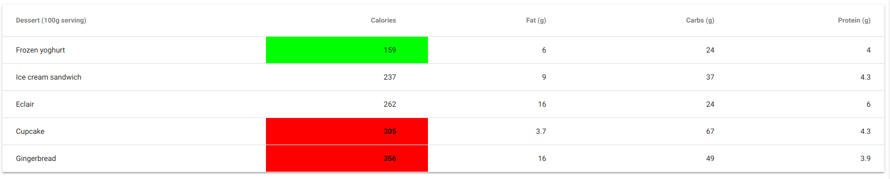

# jss-material-ui
Provide seamless components styling to material-ui

# Introduction
Material-ui 1.0 is a great react library, but its css to jss styling could be enhanced.


# Drawback of the styling provided by material-ui

* doesn't support props
* Styles are applied globally resulting to a lot of warning for the styles not maching the processed component


# The solutions until now to resolve these problems
Some suggest to use styled libraries like styled-component, glamorous, emotion, ... to resove these problems

They resolve it, but two new problems arrive: 

* stylesheet priorisation. 
* two css engines on the system which provide more complexity for the app


# A new small styled libray
So I decided to develop a library with the folowing objective:

* use material-ui styling system, so compatibiity is 100%
* more component oriented
* provide props


# A little sample

## without props


```js
import style from 'jss-material-ui'

// a container style
const ContainerRoot = style(Paper)({
  root: {
    width: '100%',
    marginTop: 3,
    overflowX: 'auto'
  }
})

// container use
<ContainerRoot />
```

The first style is applied to the corresponding styled component.

Its name is generally root. Permits to avoid material-ui warning message.
If you don't have style to pass to the component, you can write 

```js
root: {}
```

## with props

```js
import style from 'styled'
import TableCell from '@material-ui/core/TableCell'

const CaloriesCell = style(TableCell)((theme, {calories}) => ({
  root: {
    fontWeight: calories > 300 ? 700 : undefined,
    backgroundColor: calories > 300 ? '#ff0000' : calories < 160 ? '#00FF00' : undefined
  }
}))

// use
<CaloriesCell calories={n.calories} numeric>{n.calories}</CaloriesCell>
```




## Custom props

Its also possible to use custom props

```js
style(TableCell, {
     myCustomProps1,
     myCustomProps2
   })
   ((theme, {calories})
```


## Class inherithance

If a child B of a component A has for className :

```js
<A>
   <B className={classes.classB} />
</A>
```

Its possible to write that:

```js
const SA = style(A)((theme, props) => ({
  root: {
    ...
  },
  classB: {
    ...
  }
}))
```

The style specified in the ```classB``` object will be applied to B class component.
Check ```stories/SimpleTableInherit.js```


## more samples

Check ./stories directory for complete samples files.

# Limitation

Actually, the styled component doesn't support ref attribute.


